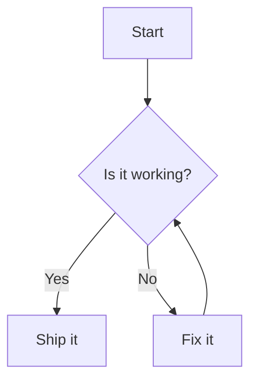

Minimal frontmatter using defaults for subtitle and image.

<Callout type="info" title="Heads up!">
This article shows multiple fenced code examples and headings. The info callout renders via MDX.
</Callout>

## Video

<YouTube id="dQw4w9WgXcQ" title="Example Video" poster="hqdefault" />

## Diagram


# Programming Languages

Let's try out different Programming Languages

## TypeScript

```tsx
export default function Component() {
  return <button className="px-3 py-1 rounded bg-blue-600 text-white">Click</button>;
}
export default function Component() {
  return <button className="px-3 py-1 rounded bg-blue-600 text-white">Click</button>;
}
```

## Python
```python
from functools import wraps

def mydecorator(func):
    @wraps(func)
    def decorator(*args, **kwargs):
        print("do something before")
        result = func(*args, **kwargs)
        print("do something after")
        return result
    return decorator
```